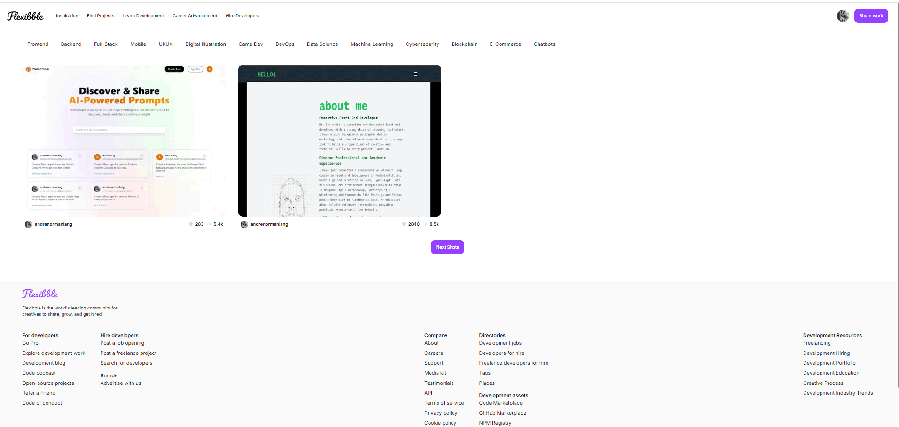

# Similar and simplified version of <https://dribble.com/> Full Stack Next.js 13 Application | TypeScript / Tailwind CSS

## Introduction

Flexibble is self-promotion clone of Dribble that serves as a social networking platform for digital designers. It serves as a design portfolio platform, jobs and recruiting site and a platform for designers to share their work online.

## Features

- Next.js 13 App Router and Server side Rendering
- Filtering Functionality
- Pagination Capabilities
- Cloudinary for handling image uploads
- Complex TypeScript
- Hasura - open-source platform with instant GraphQL APIs connected to a PostgreSQL DB.

## Learning Objectives

- Deepening Knowledge in GraphQL Querying
    To enhance my understanding of GraphQL, I implemented Hasura, an open-source platform that provides instant GraphQL APIs. This involved:

- Schema Definition: Setting up a PostgreSQL database schema in Hasura and defining relationships between different entities.
- Complex Queries: Writing and optimizing GraphQL queries to fetch data efficiently. This included filtering, sorting, and paginating data to meet the application's requirements.
- Real-time Capabilities: Implementing real-time data updates using GraphQL subscriptions, which enhanced the responsiveness and interactivity of the application.
- Role-based Access Control: Setting up granular permissions in Hasura to ensure that different users have appropriate access levels to data.

## Mastering Google Provider Authentication

For this project, I integrated Google provider authentication using NextAuth.js. This involved:

- OAuth Flow: Understanding and implementing the OAuth 2.0 flow to authenticate users via their Google accounts.
- Token Management: Managing JSON Web Tokens (JWTs) to securely handle user sessions and protect routes.
- User Management: Creating and updating user profiles in the PostgreSQL database upon successful authentication, ensuring a seamless user experience.
- Authorization: Implementing authorization logic to control user access to different parts of the application based on their authentication status and roles.

## Implementation Details

### Hasura for GraphQL APIs

Hasura allowed for rapid setup of a robust GraphQL API layer on top of a PostgreSQL database. Key steps included:

- Database Connection: Connecting Hasura to the PostgreSQL database to automatically generate GraphQL schemas.
- API Generation: Utilizing Hasura's console to define tables, relationships, and permissions, resulting in an instantly available GraphQL API.
- Query Optimization: Writing complex GraphQL queries for various application functionalities like fetching user profiles, projects, and implementing search and filter features.

### Google Authentication with NextAuth.js

NextAuth.js simplified the integration of Google authentication by handling the OAuth flow. The process included:

- Provider Setup: Configuring Google as an authentication provider in NextAuth.js.
- JWT Handling: Customizing JWT encoding and decoding to include additional user information and manage session states.
- Secure Authentication: Ensuring secure authentication and authorization mechanisms to protect user data and application resources.

By working on these aspects, I gained practical experience and a deeper understanding of GraphQL querying, real-time data handling, and secure authentication using industry-standard practices.
